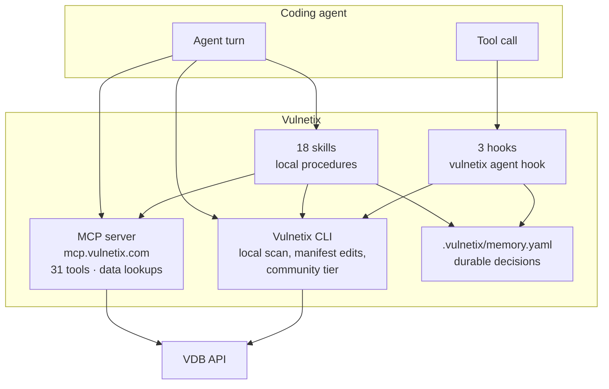

# Pix — system reference

Vulnetix for coding agents: three hooks, eighteen skills, five subagents. This
document is the architecture; `README.md` is the user-facing front door and
`skills/_lib/contract.md` is the contract every skill inherits.

## The shape of it

There are two surfaces and they do different jobs. Confusing them is what
produced 33 skills, 33 MCP prompts and 31 MCP tools all answering the same 33
questions.



**MCP is the data surface.** Fetch-and-shape verbs, already shaped, with a
declared output schema. No install. It deliberately has no community tier,
because a shared anonymous pool would collapse every caller into the quota CLI
users draw from.

**The CLI is the local surface**, and the only one that can read a working tree,
edit a manifest, or run without credentials. It is also the universal fallback.

**A hook is a process, not an agent turn**, so it cannot call MCP tools. Hooks are
CLI-only, always.

## The resolution ladder

Stated once in `skills/_lib/contract.md` and never restated:

1. `vulnetix_*` MCP tools, if the agent has them.
2. `vulnetix` on PATH.
3. Install it: brew → scoop → nix → the install script.
4. Credentials, in the CLI's own order — env vars, then `.vulnetix/credentials.json`,
   then the OS keyring, then `.netrc`.
5. With none of those, built-in Community credentials, and say so.

## Hooks

One binary, three events. `vulnetix agent hook` reads the host's payload on stdin
and writes the host's response on stdout.

| Hook | Event | Question |
|---|---|---|
| `dependency-guard` | `PreToolUse` on Bash, and on Edit/Write to a manifest | Is this dependency acceptable under the repository's Safe Harbour policy? |
| `change-guard` | `PreToolUse` on `git commit` / `git push` | Does this change carry a credential? |
| `session-context` | `SessionStart`, `UserPromptSubmit` | What did the last scan find, and does the named CVE reach this repository? |

### The response contract, measured

Probed directly against `claude` 2.1.260 and `codex` 0.153.2 rather than read out
of docs, because the docs disagreed with themselves.

| Response shape | Claude Code | Codex |
|---|---|---|
| `additionalContext`, no `permissionDecision` | model sees it | model sees it |
| `permissionDecision: "allow"` + `additionalContext` | model sees it | **hook fails** |
| `permissionDecision: "deny"` + reason | blocked, model sees reason | blocked, model sees reason |
| `systemMessage` | model never sees it | — |
| plain stdout | not shown | model never sees it |

So exactly two shapes are portable, and those are the only two emitted:

```jsonc
// inform, without interrupting
{"hookSpecificOutput":{"hookEventName":"PreToolUse","additionalContext":"…"}}

// block, with a reason the model can act on
{"hookSpecificOutput":{"hookEventName":"PreToolUse",
                       "permissionDecision":"deny","permissionDecisionReason":"…"}}
```

**Never emit `permissionDecision: "allow"`.** Codex fails the hook on it, and
omitting the field is the honest spelling anyway: the hook is not granting
permission, it is adding what it knows.

`systemMessage` alone is why the previous implementation did not work. All
fourteen hooks emitted only that, and it surfaces to the *user*, not into the
model's context — so the one actor that could fix the vulnerability was never
told.

### Silence

The dependency guard prints nothing when the repository's policy is satisfied,
which is nearly always. Measured on the shipped binary: 0 of 33 everyday commands
produce output; ~19 ms on any call that is not adding a dependency.

It never blocks on an unparseable manifest, an unreachable API, a missing
credential or a timeout — absence of an answer is not a verdict.

### Matchers

`PreToolUse` carries a tool-name matcher. `SessionStart` and `UserPromptSubmit`
carry none: they have no tool, so a matcher there registers a hook that can never
fire, which is worse than not registering it.

### Codex trust

Codex 0.153 added a hook trust gate. An untrusted hook is skipped with no error
and no output, so writing the config is not the same as the guard running.
`vulnetix agent install` says so.

## Layout

```
pix-ai-coding-assistant/
├── skills/                       # canonical — what `gh skill publish` looks for
│   ├── _lib/contract.md          # the contract every skill inherits
│   ├── dependency-choice/        # …and 17 more
│   └── <skill>/
│       ├── SKILL.md
│       └── evals/{evals,trigger-eval}.json
├── .claude/skills -> ../skills   # Claude Code follows symlinks, dedups by target
├── .agents/skills -> ../skills   # the interop path Codex, Cursor and Gemini read
├── vulnetix/                     # the Claude Code plugin
│   ├── .claude-plugin/plugin.json
│   ├── skills -> ../skills
│   ├── agents/                   # 5 subagents
│   └── hooks/hooks.json          # one config, one command
└── website/                      # Hugo docs
```

One canonical copy, reached three ways. The previous layout had skills only under
`vulnetix/`, which is why `gh skill install` and `npx skills add` never copied
`_lib/` — it has no `SKILL.md` — and why 31 of 33 skills silently returned nothing
on every agent but Claude Code.

## Frontmatter

The Agent Skills spec fixes the top-level keys to `name`, `description`,
`license`, `compatibility`, `metadata`, `allowed-tools`. The non-standard keys
this plugin used — `triggers`, `chain`, `outputBudget`, `cooldown` — move under
`metadata`, except `triggers`, which is deleted: it was read only by
`prompt-router.sh`, and that hook no longer exists. A skill is selected by its
`description`, which is why every description says *when to use it*.

`allowed-tools` is space-separated and scoped per skill:

```yaml
allowed-tools: Bash(vulnetix:*) Read Grep Glob        # read-only
allowed-tools: Bash(vulnetix:*) Read Grep Glob Edit   # edits manifests
```

No skill gets bare `Bash`. No read-only skill gets `Write`.

## Memory

`.vulnetix/memory.yaml` holds durable decisions: the last scan's counts, and one
record per finding with severity, KEV membership, status and the fix version.

`session-context` reads it at SessionStart to tell the agent what the repository
already knows, and on `UserPromptSubmit` to answer whether a named CVE is in it.
So what a skill records is what the next session opens with.

Mutating skills append a `history` event. Read-only skills write nothing. A skill
making inner CLI calls passes `--disable-memory` on them and does one consolidated
write at the end.

## Capabilities

`.vulnetix/capabilities.yaml` records which tools this machine has and which
project markers this repository has, so a skill can scope itself.

`vulnetix agent capabilities` writes it. It was a shell hook until it moved into
Go, which is when it started being correct: the old detector tested for the
`.github/workflows` directory, so a repository with an empty one reported CI it
did not have, and it reported `auth_status: unauthenticated` for an authenticated
CLI.

## Verification

`vulnetix-fixture-app` is the shared fixture — a deliberately vulnerable
multi-ecosystem tree whose `.vulnetix/expected.json` pins finding counts, CVEs,
KEV membership and the manifest line each package anchors to. The CLI's LSP suite
and the VS Code suite already read it; the skill evals are its third consumer, so
a rule change fails one file loudly in three repositories.

Hook conformance is table-driven Go tests over recorded payloads, with no model in
the loop.
