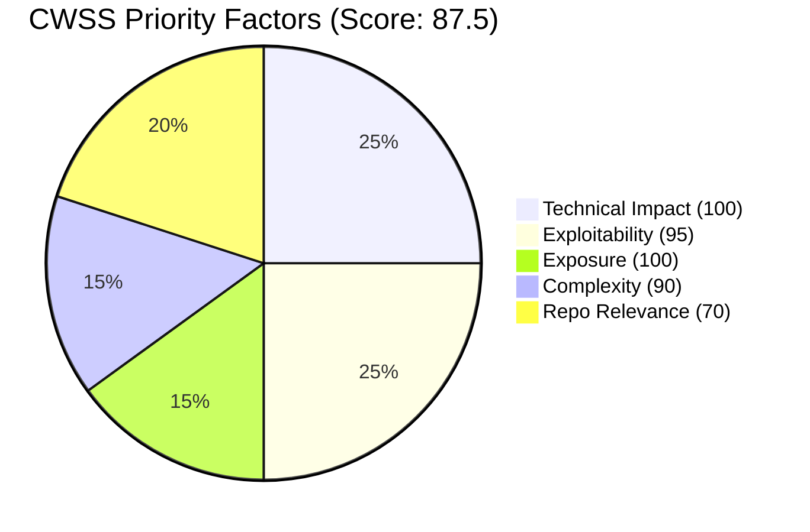

# Vulnetix Exploit Analysis Skill

## Use when

- A specific CVE just landed in your inbox and you need to decide patch urgency THIS WEEK.
- You need MITRE ATT&CK technique mapping for a vulnerability before writing detection content.
- Computing CWSS priority for a triage decision and want the full exploit-source breakdown.
- Building an incident-response brief and need cached PoC source code for static review.
- Cross-referencing `exploitationSignals` (from `package-search`) with the actual exploit count and source diversity.

## Don't use for

- Listing exploits across many CVEs — use `/vulnetix:exploits-search`.
- Just looking up the CVE record — use `/vulnetix:vuln`.
- Generating IDS/IPS detection rules — use `/vulnetix:detection-rules`.
- Executing a PoC against a target — Pix never executes; use `/vulnetix:exploit-test` to GENERATE a runnable command for manual execution.

## Conventions

This skill follows [`_lib/contract.md`](../_lib/contract.md): the Vulnetix CLI is auto-installed by hooks, `.vulnetix/capabilities.yaml` is always present, every `vulnetix vdb` call is piped through a verified `jq` filter from [`_lib/jq/`](../_lib/jq/), independent calls run in parallel as concurrent Bash tool calls, and trailing follow-ups are limited to one line. See the contract for output style, memory write rules, and cooldowns.


This skill analyzes exploit intelligence for a specific vulnerability (CVE, GHSA, etc.) and assesses its impact against the current repository. **This skill does not modify application code** — it only updates `.vulnetix/memory.yaml` to track findings. Use `/vulnetix:fix` for remediation.

## Output & Analysis Guidelines

**Primary output format:** Markdown. All reports, tables, assessments, and evidence summaries MUST be presented as formatted markdown text directly — never generate scripts or programs to produce output that can be expressed as markdown.

**Visual data — use Mermaid diagrams** to display data visually when it aids comprehension. Mermaid renders natively in markdown and requires no external tools. Use it for:
- Attack path / kill chain visualization → `graph TD`
- CWSS factor breakdown → `pie` or `quadrantChart`
- Exploit timeline (discovery dates, PoC releases) → `timeline`
- Threat model reachability → `flowchart` (dependency → vulnerable code → exposure)
- Priority comparison across multiple vulns → `bar` or `xychart-beta`

Example — CWSS factor breakdown:
````markdown

````

Example — attack path:
````markdown

````

**If `uv` is available**, richer visualizations can be generated with Python (matplotlib, plotly) and saved to `.vulnetix/`:
```bash
command -v uv &>/dev/null && uv run --with matplotlib python3 -c '
import matplotlib.pyplot as plt
# ... generate chart ...
plt.savefig(".vulnetix/chart.png", dpi=150, bbox_inches="tight")
'
```
When Python charts are generated, display them inline and keep the Mermaid version as a text fallback.

**Data processing — tooling cascade (strict order):**

1. **jq / yq + bash builtins** (preferred) — `jq` for JSON extraction/filtering (API responses, CycloneDX SBOMs), `yq` for YAML (memory file reads). Pipe to `head`, `tail`, `cut`, `sed`, `grep`, `sort`, `uniq`, `wc` for shaping.
2. **uv** (for complex analysis or charts) — If CWSS scoring, statistical aggregation, or visualization beyond Mermaid are needed, check `uv` first:
   ```bash
   command -v uv &>/dev/null && uv run --with pandas,matplotlib python3 -c '...'
   ```
3. **python3 stdlib** (last resort) — Only if `uv` is unavailable. Use `json`, `csv`, `collections`, `statistics`, `math` modules — **no pip dependencies**:
   ```bash
   command -v python3 &>/dev/null && python3 -c 'import json, sys; ...'
   ```

**Never assume any runtime is available** — always check with `command -v` before use. If all programmatic tools are unavailable, perform CWSS calculations manually and present results as markdown with Mermaid diagrams.

**CWE pattern matching** (Step 5 `grep` commands for code analysis) uses the Grep tool directly — these are not data processing and are exempt from this cascade.

## Vulnerability Memory (.vulnetix/memory.yaml)

This skill reads `.vulnetix/memory.yaml` at start and writes after every action. The full schema, field semantics, and write rules live in [`references/memory-yaml-extension.md`](references/memory-yaml-extension.md) — load that file before making any write.

## Workflow

The step-by-step workflow (CLI calls, branching logic, output assembly) lives in [`references/workflow.md`](references/workflow.md). Load it before executing — do not paraphrase from memory.

## Error Handling

- If `vulnetix vdb exploits` returns no results, inform the user that no public exploits are known (not necessarily safe — just not publicly documented). Set CWSS exploitability factor to base EPSS only.
- If `vulnetix vdb vuln` fails, continue with exploit analysis but note that CVSS/EPSS context is limited. Use available exploit records to estimate factors.
- If manifest files are missing or unreadable, note that impact analysis is inconclusive. Set `repo_relevance` to 0 and `reachability` to `unknown`.
- If `.vulnetix/memory.yaml` cannot be written (permissions, etc.), warn the user but do not block the analysis workflow.
- If CWSS factors cannot all be determined, compute with available data and note which factors used defaults. Document this in the history detail.

## Important Reminders

1. **Never execute PoC code** — static analysis only
2. This skill **does not modify application code** — use `/vulnetix:fix` for remediation
3. Always fetch both V1 and V2 exploit data if available
4. EPSS and CISA KEV are strong signals — prioritize accordingly
5. **Always update `.vulnetix/memory.yaml`** after analysis — record threat model, CWSS score, findings, and any user decisions
6. **ATT&CK IDs and CWSS internals are never shown to the user** — only developer-friendly language
7. **Decisions and status changes from exploit analysis alone** are limited to technical updates (`severity`, `safe_harbour`, `threat_model`, `cwss`). Status/decision changes require explicit user feedback, with one exception: if the package is confirmed absent from the repo, set `not-affected` automatically.
8. When a vulnId is encountered again in a future invocation, the prior `threat_model` and `cwss` serve as baseline — update them with new findings rather than starting from scratch.

## Edge cases & gotchas

- The `.exploits[]` array is the firehose — 10,623 entries for CVE-2021-44228. Always pipe through `_lib/jq/exploits.jq` which keeps the `summary` per-source rollup + top 5 deduped samples per source.
- Multiple `.exploits[]` entries can share the same `.poc.originalUrl` (forks, mirrors). The jq filter dedupes via `unique_by(.poc.originalUrl // .poc.exploitId // .uuid)`.
- Source name `github-poc` (lowercase, hyphenated) is the canonical for GitHub PoCs — not `github`, not `GitHub`.
- `vdb ai-assisted-exploits` is a separate endpoint for AI-generated demonstration scripts; do not assume `vdb exploits` includes them.
- Raw response is 12 MB. Without the filter, even a partial paste will exhaust most LLM contexts.
- PoC source is cached to `.vulnetix/pocs/<VULN_ID>/` for static analysis only. The skill never executes; respect that boundary.
- `summary.poc` (count = 10372 for log4j) includes generic PoCs not tied to a specific source — useful for "how widely public is this exploit?" judgments.
