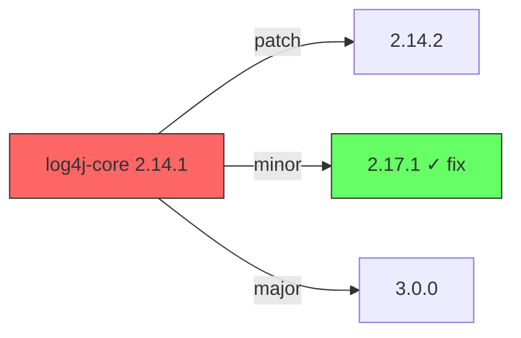

<!-- GENERATED by scripts/gen-docs.mjs. Do not edit; change the source and regenerate. -->

**Arguments:** `<vuln-id>`

**Grants:** `Bash(vulnetix:*) Read Grep Glob Edit`

**Typically followed by:** `verify-fix`, `vex-publish`

# Vulnetix Fix Intelligence Skill

## Use when

- You have a triaged CVE and want a concrete remediation proposal — not just "upgrade".
- A version bump conflicts with peer-deps and you need to evaluate inline-as-first-party-code (Type A0) or patch (Type B).
- You need to apply the fix, regenerate the lockfile, run a dry-run scan, and produce a CycloneDX SBOM in one workflow.
- Generating rollback-safe manifest edits with `.vulnetix-backup` so you can revert.
- Cross-checking registry fixes vs. distro patches vs. upstream source PRs.

## Don't use for

- Just understanding the CVE — use `vulnetix_vuln` (MCP) or `vulnetix vdb vuln <id>` or `vulnetix_exploits` (MCP).
- Verifying the fix landed — use `verify-fix`.
- Resolving a peer-dep conflict that blocks the fix — use `dep-resolve`.
- Building a multi-CVE upgrade plan — use the `@dep-upgrade-orchestrator` agent.

## Conventions

Follows `skills/_lib/contract.md`. In short: use the `vulnetix_*` MCP tools when the agent has them and the CLI otherwise — both shape their own output, so there is no jq step any more. Independent calls go out as concurrent Bash tool calls in one message. One trailing suggestion, not a playbook. See the contract for surface selection, output style and memory writes.


This skill fetches fix intelligence for a vulnerability and proposes concrete, actionable remediation steps for the current repository.

## Output & Analysis Guidelines

**Primary output format:** Markdown. All reports, tables, fix options, version diffs, and verification summaries MUST be presented as formatted markdown text directly — never generate scripts or programs to produce output that can be expressed as markdown.

**Visual data — use Mermaid diagrams** to display data visually when it aids comprehension. Mermaid renders natively in markdown and requires no external tools. Use it for:
- Dependency upgrade paths → `graph LR` showing current → target version with breaking change annotations
- Fix option comparison → `quadrantChart` plotting Safe Harbour confidence vs. version change magnitude
- Dependency tree showing vulnerable path → `graph TD` (root → parent → vulnerable dep)
- Post-fix verification status → `flowchart` (scan → tests → result)

Example — upgrade path:
````markdown

````

**If `uv` is available**, richer visualizations can be generated with Python (matplotlib, plotly) and saved to `.vulnetix/`:
```bash
command -v uv &>/dev/null && uv run --with matplotlib python3 -c '
import matplotlib.pyplot as plt
# ... generate chart ...
plt.savefig(".vulnetix/chart.png", dpi=150, bbox_inches="tight")
'
```
When Python charts are generated, display them inline and keep the Mermaid version as a text fallback.

**Data processing — tooling cascade (strict order):**

1. **jq / yq + bash builtins** (preferred) — `jq` for JSON (API responses, CycloneDX SBOMs, package manager output), `yq` for YAML (memory file). Pipe to `head`, `tail`, `cut`, `sed`, `grep`, `sort`, `uniq`, `wc` for shaping.
2. **uv** (for complex analysis or charts) — If dependency graph analysis, version comparison logic, or visualization beyond Mermaid are needed, check `uv` first:
   ```bash
   command -v uv &>/dev/null && uv run --with pandas,matplotlib python3 -c '...'
   ```
3. **python3 stdlib** (last resort) — Only if `uv` is unavailable. Use `json`, `csv`, `collections`, `statistics` modules — **no pip dependencies**:
   ```bash
   command -v python3 &>/dev/null && python3 -c 'import json, sys; ...'
   ```

**Never assume any runtime is available** — always check with `command -v` before use. If all programmatic tools are unavailable, analyze manually with the Read tool and present results as markdown with Mermaid diagrams.

**Package manager commands** (`npm install --dry-run`, `pip show`, `go mod tidy`, `cargo check`, etc.) are exempt — they are executed directly as part of the fix workflow, not for data analysis.

## Mandatory Reporting Requirements

**Every output and report from this skill MUST include the following version and provenance information for each affected package:**

### Package Version Reporting

All reports MUST display:

| Field | Description | Required |
|-------|-------------|----------|
| **Current Version** | The version currently installed/resolved | Always |
| **Version Source** | How the version was determined (see below) | Always |
| **Fix Target Version** | The patched version to upgrade to | When available |
| **Fix Source** | Registry, distro patch, or source commit hash | Always |
| **Safe Harbour Confidence** | Confidence score 0.00–1.00 (see below) | Always |

### Version Source Transparency

You MUST be transparent about how the current version was determined. Report one of:

- **User-supplied** — the user provided the version directly
- **Manifest** — read from a package manager manifest file (state which file)
- **Lockfile** — read from a lockfile (state which file)
- **Installed** — derived from the installed package on the filesystem:
  - npm/node: read `node_modules/<pkg>/package.json` (search parent directories too)
  - Python: run `pip show <pkg>` or read `site-packages/<pkg>/METADATA`
  - Go: read `go.sum` or run `go list -m <pkg>`
  - Rust: read `Cargo.lock` or run `cargo metadata`
  - System binaries: run `<binary> --version` or check `PATH` resolution
  - Ruby: run `gem list <pkg>` or read `Gemfile.lock`
  - Maven: read effective POM or local `.m2` cache
- **Context** — the version was already present in conversation context
- **Unknown** — version could not be determined (explain why)

If the user does not supply the version and it is not in conversation context, you MUST attempt to derive it from the filesystem before reporting "Unknown". Search outside the current working directory if needed — check parent directories, global package manager directories, and gitignored directories (e.g., `node_modules/`, `vendor/`, `.venv/`, `target/`, `__pycache__/`).

### Safe Harbour Confidence Score

Express the Safe Harbour score as a decimal between 0.00 and 1.00 where 1.00 = 100% confidence the fix resolves the vulnerability without introducing regressions or breaking changes.

**Confidence tiers:**
- **High confidence (> 0.90):** Patch-level bump in the same minor version, official registry release, well-tested fix, minimal API surface change
- **Reasonable confidence (0.35–0.90):** Minor version bump, distro-repackaged patch, source fix from upstream with commit hash, some API changes but backward-compatible
- **Low confidence (< 0.35):** Major version bump, unofficial patch, cherry-picked commit from development branch, significant API changes, no upstream release yet

**What factors adjust confidence:**
- Registry-published release with changelog: +0.15
- Distro-maintained patch (e.g., Debian, Ubuntu, RHEL): +0.10
- Upstream commit hash verified in release tag: +0.10
- CISA KEV listed (validated exploitation): +0.05 (urgency signal, not fix quality)
- Major version jump: −0.25
- No test suite in project to validate: −0.15
- Transitive dependency (indirect control): −0.10
- Built from source with untagged commit: −0.20

**Report format for each affected package:**

```
Package: <name>
Current Version: <version> (source: <version-source>)
Fix Target: <version> (source: <registry|distro <name> <version>|commit <hash>>)
Safe Harbour: <score> (<High|Reasonable|Low> confidence)
```

## Vulnerability Memory File (.vulnetix/memory.yaml)

This skill reads `.vulnetix/memory.yaml` at start and writes after every action. The full schema, field semantics, and write rules live in [`references/memory-yaml-schema.md`](references/memory-yaml-schema.md) — load that file before making any write.

## Workflow

The step-by-step workflow (CLI calls, branching logic, output assembly) lives in [`references/workflow.md`](references/workflow.md). Load it before executing — do not paraphrase from memory.

## Error Handling

- If `vulnetix vdb fixes` returns no results, inform the user that no official fix is available yet. **Automatically check for Snort rules** by running `vulnetix vdb traffic-filters "$ARGUMENTS" -o json` — if rules exist, present them as an immediate network-level mitigation. Also suggest workarounds or monitoring. Still record the vuln in `.vulnetix/memory.yaml` with `status: under_investigation`.
- If the package is not found in the repository, confirm with the user whether it's a transitive dependency. Record as `status: not_affected`, `justification: component_not_present` if confirmed absent.
- If manifest format is complex (Gradle, multi-module Maven), ask the user which file to edit
- If breaking changes are expected, warn the user and recommend testing thoroughly
- If version cannot be determined from any source, report "Unknown" with an explanation and ask the user to provide it
- If dry-run fails, restore backups and report the conflict
- If `.vulnetix/memory.yaml` cannot be written (permissions, etc.), warn the user but do not block the fix workflow

## Security Notes

- **Always upgrade to the latest patched version** unless there are known regressions
- If a vulnerability has a **CISA KEV due date**, prioritize it as urgent
- For **critical/high severity** vulnerabilities, recommend immediate patching even if it requires major version bumps
- Never downgrade to an older version as a "fix" — this may introduce other vulnerabilities
- When inlining code, always preserve license attribution
- When refactoring imports, verify the reduced import set still covers all usages in the codebase via **Grep**

## Integration with Other Skills

- If exploits are known, suggest running `vulnetix vdb exploits $ARGUMENTS` first to understand impact
- After fixing, suggest re-running `vulnetix_package_search` (MCP) if adding new dependencies as alternatives
- The `vulnetix_exploits` (MCP) and `vulnetix_package_search` (MCP) skills also read and contribute to `.vulnetix/memory.yaml` — decisions made in any skill are visible to all others
- **When no patch is available, Safe Harbour is low (< 0.35), or the user's triage decision is not a patch** (e.g., `risk-accepted`, `deferred`, `mitigated`), automatically fetch Snort rules via `vulnetix vdb traffic-filters "$ARGUMENTS" -o json` and offer them as an interim network-level defense. Present each rule's `rawText` for direct IDS/IPS deployment.

## Edge cases & gotchas

- `vdb fixes <id>` response top-level keys are `summary`, `timeline`, `exploitationMaturity`, `kevRequiredAction`, `cweRemediations`, `fixes{registry,distributions,sourceCode,solutions,workarounds,configurations}`, `aiAnalysis`, `vendorComments`. Pipe through `_lib/jq/fixes.jq` to extract.
- The `.fixes.registry[]` array is empty for many ecosystems — distros and source patches are often the only options. Check `.summary.{registryFixes,distributionPatches,sourceFixes}` counts first.
- `kevRequiredAction` is the authoritative CISA directive — 300-400 chars typical. Never truncate when presenting to the user.
- `exploitationMaturity.factors.crowdSecSightings` is the count of real-world attacks. Treat > 100 as "weaponised in the wild".
- Dry-run scan with `vulnetix scan --evaluate-sca --severity high --exploits weaponized` returns non-zero exit if a weaponised vuln remains — use that as the gate.
- The 5 fix types (A0 inline, A version bump, B patch, C workaround, D advisory) are ranked by user-impact, not by reliability. Inline is highest-control but highest-maintenance.
- For `not-affected` decisions backed by reachability analysis, set `decision.choice: not-affected` (closed enum) — arbitrary strings break the dashboard.
